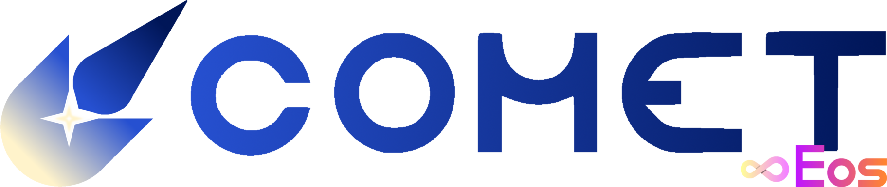

<p align="center">
    
</p>

# Empower your orbit.


[](https://www.roblox.com/users/32573334/profile)
[](mailto:ebgui.staff@gmail.com)
[](https://discord.gg/z3QZzFJBvj)

Comet, created by Eos Development, is the sole top internal user interface for [Gamer Robot's Elemental Battlegrounds](https://www.roblox.com/games/566399244/SOLAR-Elemental-Battlegrounds). With an all-new, fully modular, optimized approach to functions thought static and stagnant before, Comet breathes new life into your favorite game like nothing ever seen before.

---

## Disclaimer

**Eos Development assumes no responsibility for any consequences of improperly using Comet and/or its features.** Using any user interface like Comet in unintended or malicious manners may result in your account being banned from Elemental Battlegrounds or Roblox. By using Comet, you fully acknowledge and accept the possibility of these events, and absolve Eos Development of any responsibility. ***<u>User discretion and caution is advised.</u>***

<!-- 
===
The Terms and Conditions line below has been commented out, as one will be drafted
when Comet is nearing full production.
===

## Terms and Conditions

You can view the Terms and Conditions for using this script [at this link.](https://bit.ly/EosTnC) While using Comet and its features, you will be bound by these terms; read them carefully.
-->

## Loading

Comet requires the use of an executor. Examples of executors are [Wave](https://getwave.gg) and [Solara](https://getsolara.dev), which are paid and free, respectively. Not all executors may be supported; a list of currently tested executors can be found in the [Eos Development Discord](https://discord.gg/z3QZzFJBvj). You then simply need to execute Comet via `loadstring()`;

```lua
local Comet = loadstring(game:HttpGet("https://raw.githubusercontent.com/Eos-Comet/Comet/master/Comet.lua"))()
```

Upon execution of Comet for the first time, it will begin by attempting to download assets. **Depending on your network connection and CPU, this may take a while.** Subsequent loads of Comet will not require this loading; rather, you can check for file integrity and whether you have the right files from [the Settings menu](docs/features.md).

Afterward, our proprietary passkey system Orion will prompt you for the passkey of your subscription plan (see [Memberships](#memberships)). 

## Features

A few features of Comet include, but are not limited to;

- Instant-aiming attacks
- Infinite sprinting
- A detailed ESP

This list is not comprehensive, and more features may be added as time goes on. See the changelog below for more information.

You can also create your own features for Comet! See [the documentation for Comet's modules](docs/modules.md) for more information on how to create a feature.

## Contributions

As Comet is entirely proprietary, contributions and pull requests are not accepted at this time. If you have any suggestions, issues, or bug reports, please visit the appropriate channel in the Eos Development Discord to open a ticket. For business or other inquiries related to Comet or Eos Development, you may use the email address provided by the "Contact Us" badge.

**Note:** Not all suggestions can or will be implemented, but those that do will also be added to Comet's Welcome screen.

## Memberships

Comet $\color{ffd700}Star$, $\color{7fffff}Nova$, and $\color{ff69b4}Supernova$ are premium, subscription-based bonus features services that provide you with more features than $\color{ffffff}Basic$ does.

In projects prior to Comet, certain features were deemed too overpowered or game-breaking to provide to the general public. We also didn't want to simply remove these features, though. The solution we decided on was a subscription-based system, which solved our problems three-fold;
1. It provides a method for all of our users to donate and help fund more updates to Comet,
2. It provides users exclusivity in knowing they're part of a special group,
3. It prevents servers from being entirely overrun by these potentially game-breaking features.

Below is a walkthrough of how you can upgrade, and some things to keep in mind when doing so!

### Upgrading your Membership

If you're an [Eos Development Patron on Patreon](https://www.patreon.com/user?u=78750394), you're already set! Active Eos Development Dusk and Dawn Patrons get Comet $\color{ffd700}Star$ and $\color{7fffff}Nova$ as a thank you! Otherwise, you have only two steps you need to take;

1. Join the Eos Development Discord server, and ensure you're verified.
2. Via Discord Server Subscriptions, subscribe to either the Comet $\color{ffd700}Star$, $\color{7fffff}Nova$, or $\color{ff69b4}Supernova$ tiers.

It's just that easy. Use the tier-specific passkey provided in the channels unlocked, and you'll be on your way!

<!--
===
This section is not currently in use as the Terms of Use for Comet are still being drafted.
When Comet is in full production and the Terms of Use have been created, this will be
visible.
===

### Membership Passkey Sharing

Pursuant to section *X* of the Comet Terms of Use, membership keys are *not* to be given to other users. Those who want the current key for their tier are required to go through the same methods every member uses; checking the appropriate Discord channel. Please refer to the [Comet Terms of Use](https://example.com) for more information regarding this.-->

### Promotional Membership Keys

Promotional keys have hard-coded time-bombs in them, and will expire on the provided date and time as was advertised. When using a Promotional key, the loading splash in the console *and* a notification on load will tell you when your key will expire.

## FAQs

### Platform or Game Bans

As previously stated in the disclaimer above<!-- *and* in section X of the Comet Terms of Use -->, due to the nature of scripts like Comet as a whole, the possibility of being banned on either Elemental Battlegrounds or Roblox overall is non-zero. ***If you are banned from either EBG or Roblox, Eos Development can do nothing to assist you.*** If you *are* banned, however;

1. Your [Membership](#memberships) key will still work for other accounts. No transfer of keys or payment methods is required.
2. We encourage you to make a ticket with us in the Discord server to explain what Comet feature you were using when you were banned. We can then investigate and determine if a change needs to be made to a feature.

### Problems Loading/Using Comet

When loading Comet, you should first be greeted with Orion, our proprietary passkey system. You'll need to provide the key associated with your membership (see above); you can find this. 

#### Orion doesn't accept your passkey; "Invalid or outdated passkey! Did you type it in correctly?"

Your key is either incorrect or outdated. You'll need to ensure that you've properly copied and pasted/typed your key, and that you're using the most up-to-date version. 

#### Orion doesn't accept your passkey; "Promotional period expired! Thanks for using Comet."

Your promotional key has expired and can no longer be used. You can enter the developer console (F9) to see when the key expired on. You'll need to find a valid key to use Comet.

#### Orion doesn't accept your passkey; no notification appears

If you enter your key and nothing happens, first ensure you've taken the steps to submit the key (i.e. pressing "Submit" or pressing Enter). If Orion continues to do nothing, please join the Eos Development Discord and open a ticket.

#### Orion doesn't accept your passkey; "You aren't authorized to use Comet! Please open a ticket in our Discord. Reason: *\<reason>*"

This message means you've been blacklisted from Comet and are unable to use it at this time. Blacklists can be temporary, and will always have a reason provided. To review a blacklist instance or to appeal it, please join the Eos Development Discord and open a ticket.

#### Orion fails to open; a crash report was made, or a Luau error was provided

**Please join the Eos Development Discord and open a ticket as soon as you can.** This means something went wrong on initialization that Comet couldn't handle. Once you've opened a ticket, provide us with the crash report and/or error that was created. The crash report can be found in your executor's Workspace folder, in a subfolder made by and for Comet itself.

### Obtaining Valid Keys

**User-specific keys will *NOT* be provided under any circumstances.**

The key for your membership can be found on the proper updates channel dedicated to it; e.g., $\color{ffd700}Star$ members would go to the $\color{ffd700}Star$ updates channel, located in the "Comet" category. The standard key is in the Comet announcements channel. Please check the pins of each channel.

### About Blacklists

If you got [blacklisted](#orion-doesnt-accept-your-passkey-you-arent-authorized-to-use-comet-please-open-a-ticket-in-our-discord-reason-reason), you can file a **one-time** appeal at [this link](https://example.com). Keep in mind you are **not** guaranteed to be unblacklisted, and you will **not** receive notification on whether you have been unblacklisted or not.

## Credits

The SHA256 implementation used in Comet was found open-source, initially created by GravityScore from the [computercraft forums](http://www.computercraft.info/forums2/index.php?/topic/8169-sha-256-in-pure-lua/). Further improvements and optimizations, including a refactoring into a metatable function, were done by the Eos Development team.

## Changelog

<sup>Entries in this changelog are denoted by using asterisks (*) for changes, pluses (+) for additions, and dashes (-) for removals.</sup>

### Latest Version - v0.0 Lockheed Martin

- `[+]` Welcome to Comet! This initial alpha version will serve as a baseline for anything more to come. Thank you for using our humble script!