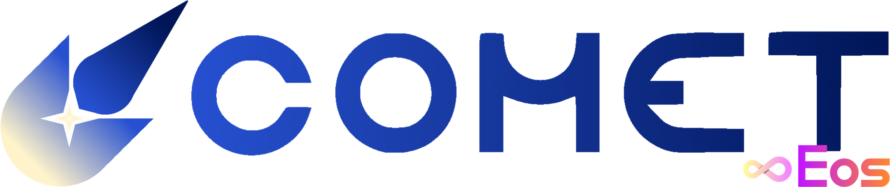

    

# Empower your orbit.

Comet, created by Eos Development, is the sole top internal user interface for [Gamer Robot's Elemental Battlegrounds](https://www.roblox.com/games/566399244/SOLAR-Elemental-Battlegrounds). With an all-new, fully modular, optimized approach to functions thought static and stagnant before, Comet breathes new life into your favorite game like nothing ever seen before.

---

## Introduction

Comet has a variety of built-in features and functionality right out of the box. 

## Disclaimer

Comet, while not intentionally designed for it, does allow the modification of data (UI or user) through its features. The ability of doing so is not officially supported, however; perform these actions at your own risk.

---